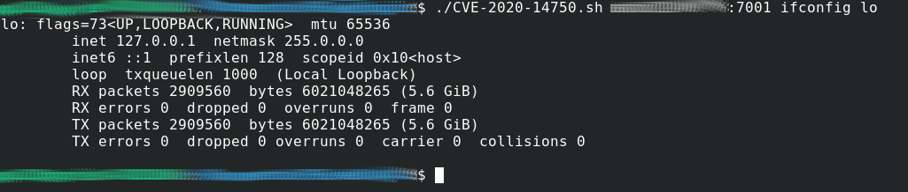

# CVE-2020-14750
PoC para las vulnerabilidades CVE-2020-14750 y cve-2020-14882

Para probar si un sistema es vulnerable usar:

./test-CVE-2020-14750 nombredelhost:7001

De momento, en esta versión, sólo garantiza si el host es vulnerable, si el resultado es negativo no es garantía de que no sea vulnerable, se implementará en siguientes versiones.
Actualización, capaz de diferenciar por la respuesta obtenida si el host es vulnerable o que ha fallado la prueba

Para su explotación debemos pasarle como primer parámetro el host, incluyendo el puerto en formato "host:puerto" y los siguientes parámetros el comando a ejecutar, por ejemplo "ifconfig lo"

Es decir:

./CVE-2020-14750 nombredelhost:7001 ifconfig lo

El payload usado no es de mi autoría, he usado el publicado en https://github.com/jas502n/CVE-2020-14882

Pedro Prieto Sánchez
twitter: @PPrietoSanchez
